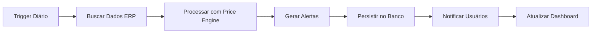
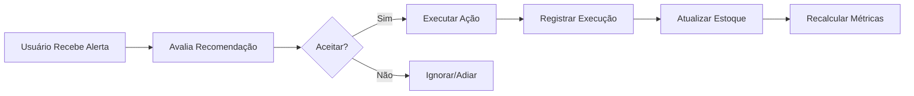

# Nexus OS v2.0 - Documento de Requisitos Técnicos

## 📋 Visão do Produto

### Declaração de Valor
**Nexus OS** converte dados brutos de estoque em **ações focadas em lucro**, garantindo tomadas de decisão proativas, redução de perdas e liberação de valor financeiro dormente dentro das operações de inventário.

### Público-Alvo
- E-commerces com 100+ SKUs
- Varejistas com múltiplos canais de venda
- Distribuidores com giro de estoque médio-alto
- Empresas com capital significativo imobilizado em inventário

## 🎯 Objetivos de Negócio

| Objetivo | Métrica Alvo | Prazo |
|----------|--------------|-------|
| Redução de rupturas | Diminuir eventos de falta em 35% | 90 dias |
| Redução de dead stock | Diminuir capital parado em 25% | 120 dias |
| Otimização de preços | Aumentar margem em 15% | 60 dias |
| Automação de decisões | 20% das ações automatizadas | 180 dias |
| Eficiência operacional | Tempo médio de decisão < 10 minutos | 30 dias |

## 🏗️ Arquitetura Técnica

### Stack Tecnológica

- **Frontend**: Next.js 16 (App Router), React, Mantine UI
- **Backend**: Next.js API Routes, Server Actions, Inngest (background jobs)
- **Banco de Dados**: PostgreSQL com Prisma ORM
- **Autenticação**: NextAuth.js
- **Logging**: Pino
- **Testes**: E2E Playwright
- **Observabilidade**: OpenTelemetry
- **Deploy**: Containerizado com Docker, CI/CD GitHub Actions

### Requisitos do Sistema
```yaml
servidor:
  cpu: 2+ cores
  memoria: 4GB+ RAM
  armazenamento: 50GB SSD
  sistema: Node.js 18.17+
  banco_dados: PostgreSQL 14+

cliente:
  navegador: Chrome 90+, Firefox 88+, Safari 14+
  resolucao: 1280x768+
  javascript: Habilitado
  conexao: 5mbps+
```

## 📊 Requisitos Funcionais

### RF01: Integração com ERPs
**Prioridade: Crítica**
- RF01.1: Conexão OAuth 2.0 com Bling ERP
- RF01.2: Sincronização incremental de produtos
- RF01.3: Importação de histórico de vendas (30/60/90 dias)
- RF01.4: Atualização em tempo real de estoques
- RF01.5: Webhooks para eventos do ERP

### RF02: Sistema de Alertas Inteligentes
**Prioridade: Crítica**
- RF02.1: Detecção automática de risco de ruptura
  - Cálculo de VVD (Vendas por Dia)
  - Dias restantes de estoque
  - Ponto de reordem dinâmico
- RF02.2: Identificação de dead stock
  - Capital imobilizado por produto
  - Dias sem vendas
  - Custo de oportunidade
- RF02.3: Detecção de oportunidades
  - Crescimento de demanda
  - Potencial de ajuste de preço
  - Novos produtos promissores

### RF03: Motor de Recomendações
**Prioridade: Alta**
- RF03.1: Algoritmo de priorização baseado em impacto financeiro
- RF03.2: Simulação de cenários de pricing
- RF03.3: Recomendações acionáveis com justificativa
- RF03.4: Estimativa de impacto financeiro
- RF03.5: Timeline de execução sugerida

### RF04: Dashboard Executivo
**Prioridade: Alta**
- RF04.1: Visão geral de KPIs financeiros
- RF04.2: Gráficos de tendência de estoque
- RF04.3: Heatmap de riscos por categoria
- RF04.4: Ranking de produtos problemáticos
- RF04.5: Exportação de relatórios (PDF/Excel)

### RF05: Fluxo de Trabalho de Ações
**Prioridade: Média**
- RF05.1: Aceitação/rejeição de recomendações
- RF05.2: Agendamento de ações
- RF05.3: Rastreamento de execução
- RF05.4: Notificações por email
- RF05.5: Integração com sistemas de compras

### RF06: Configurações e Personalização
**Prioridade: Média**
- RF06.1: Configurações por produto/categoria
- RF06.2: Limites personalizados de alerta
- RF06.3: Templates de notificação
- RF06.4: Permissões por função de usuário
- RF06.5: APIs para integração customizada

## 🔧 Requisitos Não-Funcionais

### RNF01: Performance
- RNF01.1: Tempo de carregamento inicial < 3s
- RNF01.2: Latência de API < 150ms (95º percentil)
- RNF01.3: Processamento de 1000+ produtos em < 10min
- RNF01.4: Suporte a 100+ usuários concorrentes
- RNF01.5: Cache eficiente de dados estáticos

### RNF02: Segurança
- RNF02.1: Autenticação OAuth 2.0 / JWT
- RNF02.2: Criptografia de dados sensíveis (AES-256)
- RNF02.3: Rate limiting nas APIs
- RNF02.4: Auditoria de logs de acesso
- RNF02.5: Conformidade com LGPD/GDPR

### RNF03: Confiabilidade
- RNF03.1: Uptime 99.9% (SLA)
- RNF03.2: Backup automático diário
- RNF03.3: Recuperação de desastres < 4h
- RNF03.4: Monitoramento 24/7
- RNF03.5: Alerta de falhas em tempo real

### RNF04: Usabilidade
- RNF04.1: Interface responsiva (mobile/desktop)
- RNF04.2: Tempo de aprendizado < 30min
- RNF04.3: Acessibilidade WCAG 2.1 AA
- RNF04.4: Suporte a múltiplos idiomas (pt-BR/en)
- RNF04.5: Documentação contextual

### RNF05: Escalabilidade
- RNF05.1: Arquitetura serverless-ready
- RNF05.2: Escalabilidade horizontal automática
- RNF05.3: Suporte a 1M+ produtos
- RNF05.4: Processamento assíncrono de jobs
- RNF05.5: CDN para assets estáticos

## 📁 Estrutura de Dados

### Modelo Principal do Banco
```prisma
// Esquema simplificado para referência
model BlingAlert {
  id                  String           @id @default(uuid())
  productId           String           @unique
  type                BlingAlertType   // RUPTURE, DEAD_STOCK, OPPORTUNITY
  risk                BlingRuptureRisk // CRITICAL, HIGH, MEDIUM, LOW
  metrics             Json             // Métricas calculadas
  finalRecommendation Json             // Recomendação formatada
  acknowledged        Boolean          @default(false)
  executedAt          DateTime?
  generatedAt         DateTime         @default(now())

  @@index([type, risk, generatedAt])
}

model BlingProduct {
  id               String   @id @default(uuid())
  blingProductId   String   @unique
  sku              String
  name             String
  costPrice        Float    @default(0)
  salePrice        Float    @default(0)
  stock            Int      @default(0)
  replenishmentTime Int?    @default(15)
  safetyStock      Int?     @default(0)
  lastSaleDate     DateTime?

  @@index([sku, lastSaleDate])
}
```

### APIs Principais
```typescript
// GET /api/alerts - Lista alertas com infinite scroll
interface AlertsResponse {
  alerts: BlingAlert[];
  nextCursor: string | null;
  hasMore: boolean;
}

// POST /api/alerts/:id/acknowledge - Reconhece alerta
interface AcknowledgeRequest {
  notes?: string;
  scheduledAction?: string;
}

// GET /api/metrics/summary - Métricas gerais
interface MetricsSummary {
  totalCapitalStuck: number;
  criticalAlerts: number;
  potentialSavings: number;
  monthlyTrend: number;
}
```

## 🔄 Fluxos de Trabalho

### Fluxo 1: Geração Diária de Alertas


### Fluxo 2: Ação do Usuário


## 🧪 Critérios de Aceitação

### CA01: Precisão de Alertas
- [ ] < 5% de falsos positivos em detecção de ruptura
- [ ] 95% de precisão na classificação de risco
- [ ] Cálculos financeiros com margem de erro < 2%
- [ ] Atualização em tempo real de mudanças de estoque

### CA02: Performance do Sistema
- [ ] API response time < 150ms (p95)
- [ ] Dashboard carrega em < 3s
- [ ] Processamento noturno completa em < 30min
- [ ] Suporte a 1000+ SKUs sem degradação

### CA03: Experiência do Usuário
- [ ] Tempo de aprendizado < 30 minutos
- [ ] 95% dos usuários conseguem executar ações sem ajuda
- [ ] NPS > 50 após 30 dias de uso
- [ ] Taxa de retenção > 80% no primeiro mês

### CA04: Segurança e Conformidade
- [ ] Zero violações de dados no primeiro ano
- [ ] Auditoria completa de todas as ações
- [ ] Backups automáticos e testados
- [ ] Conformidade com LGPD documentada

## 🚀 Roadmap v2.0

### Fase 1: MVP (Mês 1-2)
- [x] Integração básica com Bling
- [x] Sistema de alertas de ruptura
- [x] Dashboard básico de métricas
- [x] Autenticação de usuários

### Fase 2: Otimização (Mês 3-4)
- [ ] Motor completo de recomendações
- [ ] Alertas de dead stock e oportunidades
- [ ] Simulação de cenários de pricing
- [ ] Notificações por email

### Fase 3: Automação (Mês 5-6)
- [ ] Workflows automatizados
- [ ] Integração com sistemas de compra
- [ ] APIs para parceiros
- [ ] Relatórios avançados

### Fase 4: Escala (Mês 7-8)
- [ ] Suporte a múltiplos ERPs
- [ ] Machine learning para previsões
- [ ] App mobile
- [ ] Marketplace de integrações

## 📈 Métricas de Sucesso

### Métricas Técnicas
- **Disponibilidade**: 99.9% uptime
- **Performance**: API < 150ms p95
- **Escalabilidade**: 10.000+ produtos
- **Confiabilidade**: < 1 incidente/mês

### Métricas de Negócio
- **Adoção**: 80% dos usuários ativos diariamente
- **Satisfação**: NPS > 50
- **Retenção**: Churn < 5% mensal
- **Receita**: MRR growth > 20% mensal

### Métricas de Valor
- **Eficiência**: Redução de 35% em rupturas
- **Lucratividade**: Aumento de 15% em margens
- **Capital**: Redução de 25% em dead stock
- **Produtividade**: Decisões em < 10 minutos

## 🛠️ Ambiente de Desenvolvimento

### Setup Local
```bash
# 1. Clone o repositório
git clone https://github.com/nexus-os/core.git
cd nexus-os

# 2. Instale dependências
npm install

# 3. Configure ambiente
cp .env.example .env.local
# Edite as variáveis

# 4. Banco de dados
npx prisma generate
npx prisma db push

# 5. Execute
npm run dev
```

### Scripts Disponíveis
```json
{
  "dev": "next dev",
  "build": "next build",
  "start": "next start",
  "lint": "next lint",
  "test": "jest",
  "test:watch": "jest --watch",
  "test:coverage": "jest --coverage",
  "prisma:studio": "prisma studio",
  "prisma:generate": "prisma generate",
  "prisma:migrate": "prisma migrate dev"
}
```

## 🤝 Equipe e Responsabilidades

### Tech Lead
- Arquitetura do sistema
- Code reviews
- Decisões técnicas
- Performance e escalabilidade

### Desenvolvedores Full-Stack
- Implementação de features
- Testes e qualidade
- Documentação técnica
- Suporte a produção

### Product Manager
- Roadmap do produto
- Requisitos de negócio
- Métricas de sucesso
- Feedback de usuários

### DevOps
- Infraestrutura
- Monitoramento
- CI/CD
- Segurança

## 📞 Suporte e Manutenção

### Níveis de Suporte
- **Nível 1**: Suporte básico (24h úteis)
- **Nível 2**: Suporte técnico (12h úteis)
- **Nível 3**: Desenvolvedores (8h úteis)
- **Crítico**: 24/7 para incidentes graves

### SLA (Service Level Agreement)
- **Disponibilidade**: 99.9% mensal
- **Tempo de Resposta**: < 1h para críticos
- **Tempo de Resolução**: < 4h para críticos
- **Backups**: Diários, retenção 30 dias

---

**Documento Atualizado**: Novembro 2024
**Versão**: 2.0
**Status**: Em Desenvolvimento
**Próxima Revisão**: Dezembro 2024

*Este documento é vivo e será atualizado conforme a evolução do produto.*
