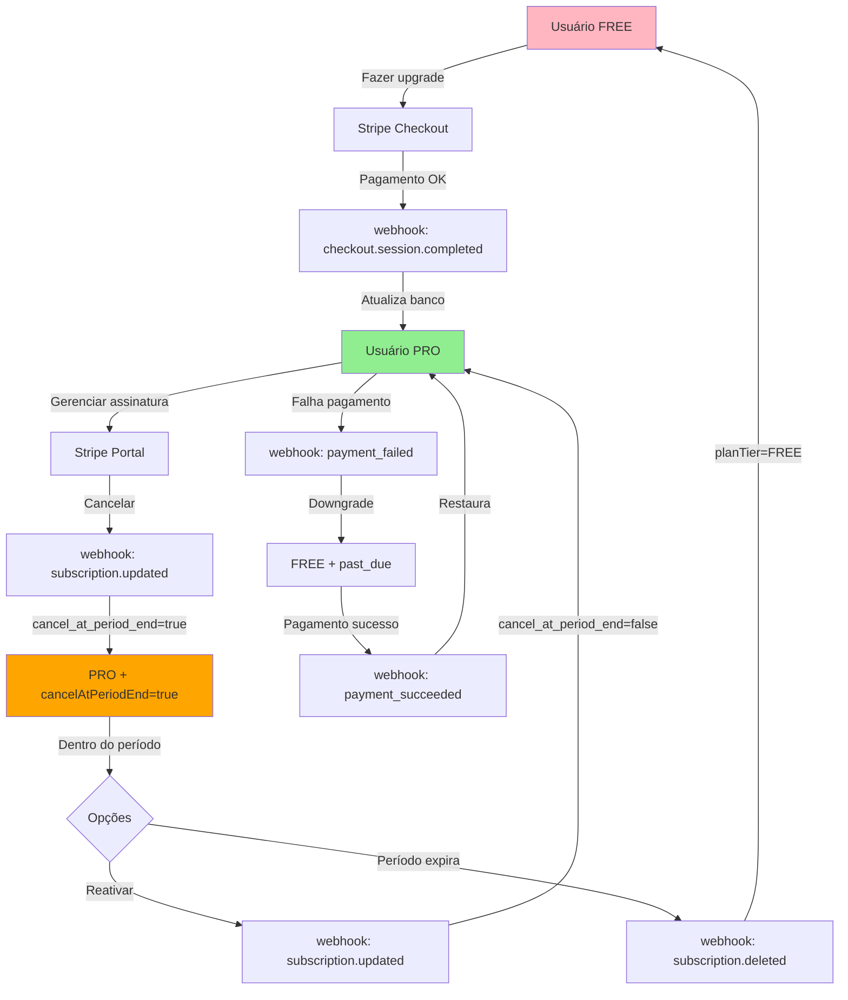

# 🎯 Teste de Cancelamento e Renovação de Assinatura Stripe

## ✅ Implementações Realizadas

### 1. **Schema do Banco de Dados**
- ✅ Adicionado campo `cancelAtPeriodEnd Boolean @default(false)` ao model User
- ✅ Migração aplicada: `20260213164711_add_cancel_at_period_end`
- ✅ Prisma Client regenerado

### 2. **Webhook Stripe** ([src/app/api/stripe/webhook/route.ts](src/app/api/stripe/webhook/route.ts))
- ✅ Função `getPlanTierFromStatus` expandida com todos os status do Stripe
- ✅ Tratamento de `cancel_at_period_end` implementado:
  - Quando `true`: mantém PRO até fim do período, define `subscriptionStatus: 'canceling'`
  - Quando subscription é deletada: `planTier: FREE`, `cancelAtPeriodEnd: false`
- ✅ Evento `invoice.payment_succeeded` melhorado:
  - Restaura PRO automaticamente após pagamento bem-sucedido se estava em FREE por falha

### 3. **Portal Stripe** ([src/app/api/stripe/portal/route.ts](src/app/api/stripe/portal/route.ts))
- ✅ `return_url` atualizada para `/minha-conta?refresh=true`
- ✅ Garante que sessão será atualizada após retorno do Portal

### 4. **Página Minha Conta** ([src/components/pages/Profile/index.tsx](src/components/pages/Profile/index.tsx))
- ✅ Implementado `useEffect` para detectar parâmetro `refresh=true`
- ✅ Chama `update()` do NextAuth para atualizar sessão JWT
- ✅ Remove parâmetro da URL após atualização
- ✅ Loading states adicionados aos botões durante refresh

### 5. **NextAuth Callbacks** ([src/lib/next-auth/index.ts](src/lib/next-auth/index.ts))
- ✅ Campo `subscriptionStatus` adicionado ao token JWT
- ✅ Campo `cancelAtPeriodEnd` adicionado ao token JWT
- ✅ Campos incluídos no callback `session` para disponibilizar no cliente
- ✅ Atualização via `trigger: 'update'` busca novos valores do banco

### 6. **TypeScript Types** ([src/types/next-auth.d.ts](src/types/next-auth.d.ts))
- ✅ `Session.user` estendido com `subscriptionStatus` e `cancelAtPeriodEnd`
- ✅ `JWT` interface estendida com os mesmos campos
- ✅ Type safety completa em toda aplicação

### 7. **Documentação** ([src/features/billing/services/stripeClient.ts](src/features/billing/services/stripeClient.ts))
- ✅ JSDoc adicionado explicando funcionalidades do Portal
- ✅ Lista de ações disponíveis documentada

---

## 🧪 Roteiro de Testes Completo

### Pré-requisitos
```bash
# 1. Servidor Next.js rodando
pnpm dev

# 2. Stripe CLI escutando webhooks (terminal separado)
stripe listen --forward-to localhost:3000/api/stripe/webhook

# 3. PostgreSQL rodando
# 4. Variáveis de ambiente configuradas no .env
```

---

## 📋 Teste 1: Criar Assinatura PRO

### Passos:
1. Acesse http://localhost:3000/login
2. Faça login com seu usuário FREE
3. Vá para http://localhost:3000/minha-conta
4. Clique em **"Fazer upgrade para PRO"**
5. Use cartão de teste: `4242 4242 4242 4242`, data futura, qualquer CVV
6. Complete o checkout

### Verificações:
```sql
-- No PostgreSQL
SELECT 
  email, 
  "planTier", 
  "subscriptionStatus", 
  "cancelAtPeriodEnd",
  "stripeSubscriptionId",
  "currentPeriodEnd"
FROM "User" 
WHERE email = 'seu@email.com';
```

**Resultado esperado:**
- `planTier`: `PRO` ✅
- `subscriptionStatus`: `active` ✅
- `cancelAtPeriodEnd`: `false` ✅
- `stripeSubscriptionId`: `sub_xxx...` (preenchido) ✅
- `currentPeriodEnd`: data futura ✅

**Na interface:**
- Badge mostra "Plano PRO" com cor verde ✅
- Banner de upgrade NÃO aparece ✅

**No terminal do Stripe CLI:**
```
✓ webhook.checkout.session.completed [200]
✓ webhook.customer.subscription.created [200]
```

---

## 📋 Teste 2: Cancelar Assinatura

### Passos:
1. Em http://localhost:3000/minha-conta
2. Clique em **"Gerenciar assinatura"**
3. No Stripe Portal, clique **"Cancel plan"**
4. Escolha **"Cancel at end of billing period"** (não "Cancel immediately")
5. Confirme o cancelamento
6. Você será redirecionado para `/minha-conta?refresh=true`

### Verificações:

**Observar console do navegador:**
```
Atualizando sessão após retorno do Stripe Portal...
```

**No banco:**
```sql
SELECT 
  email, 
  "planTier", 
  "subscriptionStatus", 
  "cancelAtPeriodEnd",
  "currentPeriodEnd"
FROM "User" 
WHERE email = 'seu@email.com';
```

**Resultado esperado:**
- `planTier`: `PRO` ✅ (mantém até fim do período!)
- `subscriptionStatus`: `canceling` ✅ (novo status indicando cancelamento agendado)
- `cancelAtPeriodEnd`: `true` ✅
- `currentPeriodEnd`: data futura mantida ✅

**Na interface:**
- Badge ainda mostra "Plano PRO" ✅
- Banner de upgrade NÃO aparece ainda ✅
- URL atualizada para `/minha-conta` (sem `?refresh=true`) ✅

**No terminal do Stripe CLI:**
```
✓ webhook.customer.subscription.updated [200]
```

**Nos logs do servidor Next.js:**
```json
{
  "eventType": "customer.subscription.updated",
  "cancel_at_period_end": true,
  "msg": "Processing subscription event"
}
{
  "oldStatus": "active",
  "newStatus": "canceling",
  "msg": "Updating user subscription"
}
```

---

## 📋 Teste 3: Reativar Assinatura Cancelada

### Passos:
1. Com assinatura cancelada mas ainda ativa (do teste anterior)
2. Em http://localhost:3000/minha-conta
3. Clique em **"Gerenciar assinatura"**
4. No Stripe Portal, clique **"Renew subscription"** ou **"Resume"**
5. Confirme a renovação
6. Será redirecionado para `/minha-conta?refresh=true`

### Verificações:

**No banco:**
```sql
SELECT 
  email, 
  "planTier", 
  "subscriptionStatus", 
  "cancelAtPeriodEnd"
FROM "User" 
WHERE email = 'seu@email.com';
```

**Resultado esperado:**
- `planTier`: `PRO` ✅
- `subscriptionStatus`: `active` ✅ (volta ao normal)
- `cancelAtPeriodEnd`: `false` ✅ (cancelamento desfeito)

**Na interface:**
- Badge mostra "Plano PRO" ✅
- Sessão atualizada automaticamente ✅

**No terminal do Stripe CLI:**
```
✓ webhook.customer.subscription.updated [200]
```

---

## 📋 Teste 4: Expiração de Assinatura Cancelada

### Simular com Stripe CLI:
```bash
stripe trigger customer.subscription.deleted
```

### Verificações:

**No banco:**
```sql
SELECT 
  email, 
  "planTier", 
  "subscriptionStatus", 
  "cancelAtPeriodEnd",
  "stripeSubscriptionId",
  "currentPeriodEnd"
FROM "User" 
WHERE email = 'seu@email.com';
```

**Resultado esperado:**
- `planTier`: `FREE` ✅ (downgrade efetuado)
- `subscriptionStatus`: `canceled` ✅
- `cancelAtPeriodEnd`: `false` ✅
- `stripeSubscriptionId`: `null` ✅ (limpo)
- `currentPeriodEnd`: `null` ✅

**Na interface (após recarregar):**
- Badge mostra "Plano FREE" ✅
- Banner amarelo de upgrade aparece ✅
- Botão "Fazer upgrade para PRO" visível ✅

---

## 📋 Teste 5: Falha de Pagamento e Recuperação

### 5A. Simular Falha de Pagamento:
```bash
stripe trigger invoice.payment_failed
```

**Verificações:**
```sql
SELECT "planTier", "subscriptionStatus" FROM "User" WHERE email = 'seu@email.com';
```

**Resultado esperado:**
- `planTier`: `FREE` ✅
- `subscriptionStatus`: `past_due` ✅

**Na interface:**
- Usuário perde acesso PRO ✅
- Banner de upgrade aparece ✅

### 5B. Simular Pagamento Bem-Sucedido:
```bash
stripe trigger invoice.payment_succeeded
```

**Verificações:**
```sql
SELECT "planTier", "subscriptionStatus" FROM "User" WHERE email = 'seu@email.com';
```

**Resultado esperado:**
- `planTier`: `PRO` ✅ (restaurado automaticamente!)
- `subscriptionStatus`: `active` ✅
- `cancelAtPeriodEnd`: `false` ✅

**Na interface (após recarregar):**
- Usuário recupera acesso PRO ✅
- Banner desaparece ✅

---

## 🔍 Queries SQL Úteis para Debug

```sql
-- Ver último status de todos os usuários
SELECT 
  id,
  email,
  "planTier",
  "subscriptionStatus",
  "cancelAtPeriodEnd",
  "currentPeriodEnd",
  "stripeCustomerId",
  "stripeSubscriptionId"
FROM "User"
ORDER BY "updatedAt" DESC;

-- Ver últimos eventos de webhook processados
SELECT 
  "eventId",
  "type",
  "processed",
  "processedAt",
  "error"
FROM "WebhookEvent"
ORDER BY "processedAt" DESC
LIMIT 20;

-- Ver eventos de subscription
SELECT 
  "type",
  "processedAt",
  "payload"->'data'->'object'->>'status' as status,
  "payload"->'data'->'object'->>'cancel_at_period_end' as cancel_at_period_end
FROM "WebhookEvent"
WHERE "type" LIKE '%subscription%'
ORDER BY "processedAt" DESC;

-- Encontrar discrepâncias
SELECT 
  email,
  "planTier",
  "subscriptionStatus",
  "cancelAtPeriodEnd",
  "stripeSubscriptionId"
FROM "User"
WHERE 
  ("planTier" = 'PRO' AND "stripeSubscriptionId" IS NULL)
  OR ("planTier" = 'FREE' AND "stripeSubscriptionId" IS NOT NULL);
```

---

## ✅ Checklist Final de Validação

### Funcionalidades Básicas
- [ ] Criar assinatura FREE → PRO funciona
- [ ] Webhook `checkout.session.completed` atualiza banco
- [ ] Badge mostra plano correto
- [ ] Banner aparece para FREE, não para PRO

### Cancelamento
- [ ] Botão "Gerenciar assinatura" abre Portal
- [ ] Cancelamento no Portal dispara webhook
- [ ] `cancelAtPeriodEnd` = `true` no banco
- [ ] `subscriptionStatus` = `canceling`
- [ ] Usuário mantém PRO até fim do período
- [ ] Sessão atualiza automaticamente ao retornar
- [ ] URL limpa (sem `?refresh=true`)

### Renovação
- [ ] Reativar subscription no Portal funciona
- [ ] `cancelAtPeriodEnd` volta para `false`
- [ ] `subscriptionStatus` volta para `active`
- [ ] Sessão atualiza automaticamente

### Expiração
- [ ] Subscription deletada → downgrade para FREE
- [ ] `stripeSubscriptionId` limpo (null)
- [ ] `currentPeriodEnd` limpo (null)
- [ ] Banner de upgrade aparece

### Recuperação de Pagamento
- [ ] Falha de pagamento → downgrade para FREE
- [ ] Pagamento bem-sucedido → restaura PRO
- [ ] `cancelAtPeriodEnd` limpo após recuperação

### Logs e Auditoria
- [ ] Stripe CLI mostra webhooks recebidos
- [ ] Servidor Next.js loga eventos processados
- [ ] Tabela `WebhookEvent` registra todos os eventos
- [ ] Timestamps corretos em todos os eventos

---

## 🚨 Troubleshooting

### Problema: Sessão não atualiza após cancelamento
**Solução:**
1. Verifique se URL contém `?refresh=true` ao retornar do Portal
2. Abra console do navegador, procure por erros
3. Verifique se `useEffect` está sendo executado
4. Tente fazer logout e login novamente

### Problema: Webhook não está sendo recebido
**Solução:**
```bash
# Verificar se Stripe CLI está rodando
stripe listen --forward-to localhost:3000/api/stripe/webhook

# Verificar se servidor Next.js está acessível
curl http://localhost:3000/api/stripe/webhook

# Testar manualmente
stripe trigger customer.subscription.updated
```

### Problema: `cancelAtPeriodEnd` não aparece no banco
**Solução:**
```bash
# Regenerar Prisma Client
npx prisma generate

# Verificar migration aplicada
npx prisma migrate status

# Aplicar migrations pendentes
npx prisma migrate deploy
```

### Problema: TypeScript errors
**Solução:**
```bash
# Limpar cache e rebuildar
rm -rf .next node_modules/.cache
pnpm typecheck
```

---

## 📊 Fluxo Completo Visualizado



---

## 🎉 Conclusão

O gerenciamento completo de assinaturas Stripe está implementado com:
- ✅ Criação de assinaturas
- ✅ Cancelamento com manutenção de acesso até fim do período
- ✅ Renovação de assinaturas canceladas
- ✅ Expiração e downgrade automático
- ✅ Recuperação após falha de pagamento
- ✅ Atualização automática de sessão JWT
- ✅ Logging detalhado para debug
- ✅ Type safety completo

Todas as ações redirecionam para `/minha-conta` e atualizam a sessão automaticamente!
